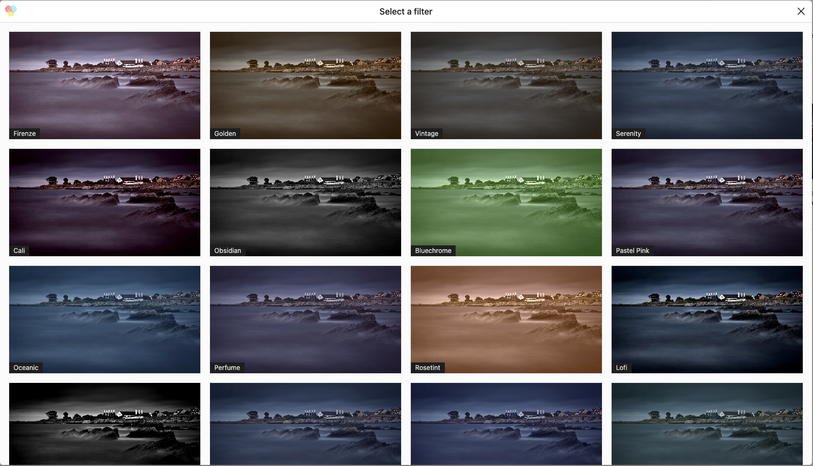

A Gutenberg block that animates in when coming into view.

View this block plugin [on WordPress.org](https://wordpress.org/plugins/image-filters)

## Features
- No server requirements.
- Clones the source image and saves it to the media library.
- Wraps around the core image block, doesn't filter it.

## Example Screenshots

