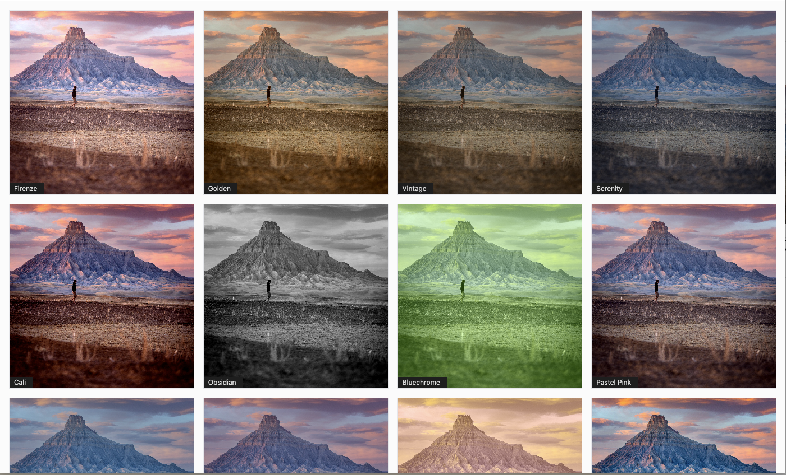
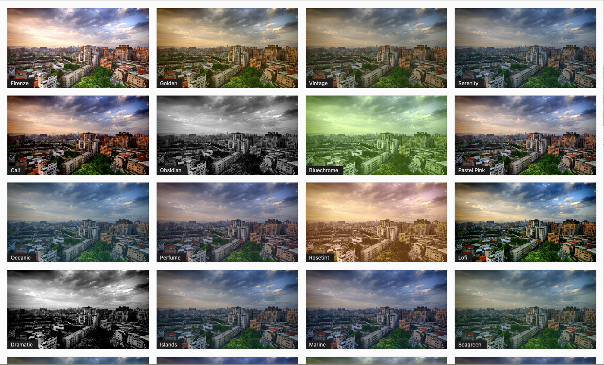

Choose from 22 beautiful filters to bring your images to life.

## Description

Image filters is a Gutenberg block that wraps around the native core image block that when opened, will generate a curated set of 22 image filters processed using the binary code of the image itself (i.e. not a CSS overlay or filter).

View this block plugin [on WordPress.org](https://wordpress.org/plugins/image-filters)

## Features
- No server requirements.
- Clones the source image and saves it to the media library.
- Wraps around the core image block, doesn't filter it.

## Example Screenshots

